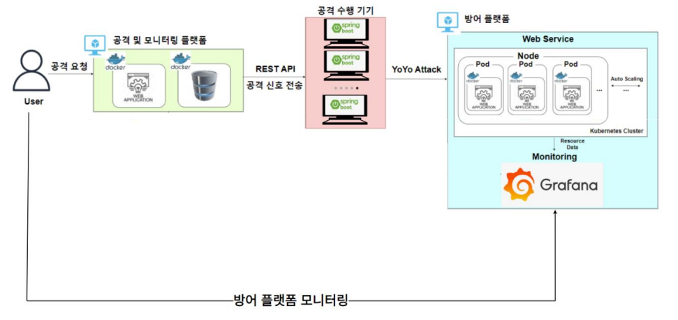

### 1. 프로젝트 소개

#### 1.1 배경 및 필요성
팬데믹 이후 클라우드 서비스 사용이 급증하면서, 해커들이 클라우드 환경에 주목하게 되어 새로운 형태의 공격이 등장하게 되었습니다. 
특히, EDoS(Economic Denial of Sustainability)는 클라우드 자원의 자동 확장 기능을 악용하여 재정적 피해를 초래하는 심각한 위협으로, 전통적인 DDoS 방어 방식으로는 막기 어려운 특성을 가집니다. 
이 연구는 이러한 클라우드 환경의 취약점을 탐구하고 효과적인 방어 방법을 제시하기 위해 수행되었습니다.

#### 1.2 목표 및 주요 내용
본 연구의 목표는 클라우드 환경에서의 YoYo Attack과 같은 공격을 실시간으로 탐지하고 방어할 수 있는 알고리즘을 개발하여, 서버 자원 관리와 비용 효율성을 동시에 보장하는 방어 메커니즘을 구축하는 것입니다. 
주요 내용으로는 응답 시간을 교란하여 공격자의 공격 지속 여부 판단을 혼란시키는 방법을 포함한 다양한 방어 기법을 실험을 통해 검증하고, 성능을 분석하는 과정이 포함됩니다.

### 2. 팀소개

이강빈, midasj0314@gmail.com, Open WRT 방어법 개발, 대시보드 UI 개발, 회로 구성

장진영, ddglackrp@pusan.ac.kr, 알고리즘 개발, 공격 플랫폼 구성

강수민, ramiregi@pusan.ac.kr, 시헐 환경 구축, 방어 플랫폼 구성, 대시보드 UI 개발

### 3. 시스템 구성도

UI: HTML, CSS, JavaScript로 구축된 대시보드(공격자 및 방어자)

방어 플랫폼(백엔드 서버): Spring Boot로 개발된 비정상 트래픽 감지 및 방어 시스템

공격 수행 기기: HTTP 요청을 통해 YoYo Attack을 수행하는 기기

Docker 및 Kubernetes: 웹 애플리케이션을 다양한 환경에 배포하고, 리소스 사용에 따른 자동 확장을 담당

Grafana: 시스템 모니터링 도구로서 애플리케이션 상태와 성능 지표 시각화 기능을 수행

### 4. 소개 및 시연 영상

### 5. 설치 및 사용법

1. 인텔리제이를 활용하여 git clone을 한다.
2. build 파일을 실행한다.
3. 공격자에서 Graph 관련 ip를 수정한다.
4. 서버(방어자)에서 redirect IP 등을 수정한다.
5. 공격자, 서버 main을 실행한다.
